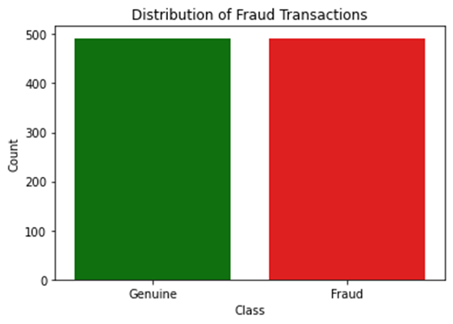

# Revolut-Fraud-Detection

For the Econometrics and Forecasting EF308 module, we were tasked with creating a new product idea for Revolut. My group's idea was an emergency credit card for those who have lost their wallet abroad.

A comprehensive report on how the project was carried out can be viewed through the PDF available, along with our product pitch video and slide deck outlining the benefits and risks for Revolut when implementing this project.

The dataset was too large to upload, however, it can be viewed through this Google Drive link [Link to Data](https://drive.google.com/file/d/1LuaYBE00i8jqiYPSBuJfqWkBClzNNjfy/view?usp=drive_link)

# The Product Idea

An Post found that 12% of Irish people lose their cards when travelling abroad and that 9/10 Irish people highly value access to emergency funds in these scenarios. Our proposed idea for Revolut was an emergency credit card. More details can be viewed in the product report file. In order to implement this credit card Revolut needed a reliable way of detecting fraud, as well as forecast the potential revenue this would generate.

Skills Showcased:

-   Supervised Machine Learning
-   Data Analysis
-   Forecasting

[View more projects like this!](https://cian-murray-doyle.github.io/)

## Libraries Overview

The following Python libraries are used for this project.

``` python
import numpy as np
import pandas as pd
import seaborn as sns
import matplotlib.pyplot as plt
from sklearn.preprocessing import StandardScaler
from sklearn.model_selection import train_test_split
from scipy.stats import norm
from sklearn.linear_model import LogisticRegression
from sklearn.metrics import confusion_matrix, classification_report
import statsmodels.tsa.api as smt
from statsmodels.tsa.arima.model import ARIMA
from sklearn.metrics import mean_squared_error
```

## Understanding the data

The data used to create our models contains credit card transactions over a 48-hour period. The dataset consists of 28 unnamed, numeric, and scaled features V1-V28 which have been gathered through principal component analysis prior to receiving the dataset. In addition to these features, the dataset contains a time column, which measures the time in seconds from the first transaction in the dataset, an amount column, and a class column, which defines each transaction as either genuine 0 or fraud 1.

Firstly, we need to remove any null values from the data, as these will alter the model significantly. Next, we want to understand how often fraud occurs and we can see that fraud merely accounts for 0.17% of the total transactions.


## Preparing the Data

As mentioned before, all other unnamed features have been pre-standardised. We can see when describing the data that Time and Amount have not yet been brought to a common scale, graphing these two features lets us visualise the difference in scale and the need to bring them to a common scale.


We need our model to be highly sensitive when it comes to detecting fraud transactions as fraud not only leads to large financial loss but also to reputational damage. If we use the dataset as it currently is due to a miniscule amount of fraud transactions the model would struggle to identify patterns in fraud transactions. It is for this reason that we need to create a subset of our data, taking transactions at random to create a 50/50 split between fraud and genuine transactions.



Now we can more accurately assess which features have a relationship with fraud transactions, to visualise this we will create a correlation matrix heatmap. Normally we would look to remove irrelevant features here but as the data has been through PCA and we cannot see the name of each feature this would be difficult. For this reason, we will look at the features with a high correlation with the Class feature.


We can see features V17, V14, V12, and V10 have a high negative correlation and V11, V4, V2, and V19 have a high positive correlation. To make the model more accurate we will look to remove extreme outliers in these features. However, to avoid overfitting the model we will opt to remove outliers from only V14, V12, and V10.


We have two methods when it comes to removing outliers z-score and interquartile range. To use the z-score it requires the feature to have a Gaussian distribution, as it uses standard deviations from the mean to remove outliers. As we can see only V14 follows a Gaussian distribution, for this reason, we will use the interquartile range opting to use the middle 50% of data.


## Building the regression model

Having our data prepared we can now work on building our regression model, we will use a logistic regression model to attempt to classify transactions as fraud or genuine. To begin the data needs to be split into training and testing sets, we opt for 80% training data. Once the model has been fit to the training data we can make predictions using the test data and assess the model's accuracy. Our model has an extremely high accuracy of 99%, which is ideal when it comes to detecting something as important as fraud. The model also has 100% precision when predicting fraud, meaning when the model predicts fraud it is correct every time. This indicates the model has identified consistent patterns in fraud transactions. The model has 98% recall when predicting fraud, meaning that the model found 98% of all fraudulent transactions.


With fraud itself being an outlier, this likely means that the fraud transactions that were not predicted are extreme outliers and don’t align with the usual pattern. We can visualise the models’ predictive power with a confusion matrix, showing us numerically the correct and incorrect predictions.


## Building the forecast model

Now without worrying about fraudulent transactions causing losses for Revolut, we can move to creating forecasts for potential revenues. We are interested in adding a % transaction fee which will be paid back along with the balance of the card, so we will look at how consistent transactions have been across our timeframe. To do this we convert the seconds to hours and add in a date to create our time frame. We can see graphing transaction value and transaction count across the two days that there is a consistent trend, indicating that Revolut can create a constant stream of income by implementing this product.


By using AIC and BIC we can find the ideal parameters for creating our ARIMA model, our data does not need to be differenced so we will ignore the I/middle parameter. Our AIC and BIC give the same parameters of 2 autoregressive terms and 5 moving average terms. Before we build the model we will split the data into training and testing sets. Due to the limited time frame of our data, we will use the first 24 hours for training and the second 24 hours for testing.


To understand the predictive power of our forecasting model more we can visualise the results on a line chart. As we can see the forecasting model isn’t accurate, backed up statistically by the models’ high root mean squared error of 276938.73. The model’s inaccuracy is likely due to the limited time series it was trained on. A longer time frame of data would allow for the creation of a more accurate forecasting model.


